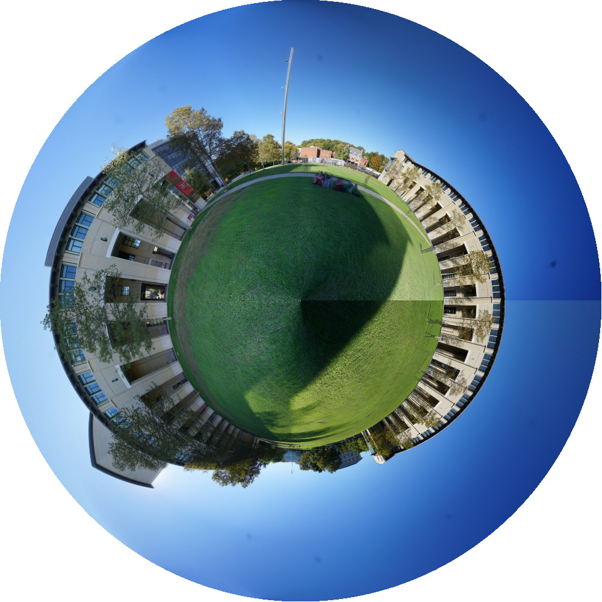
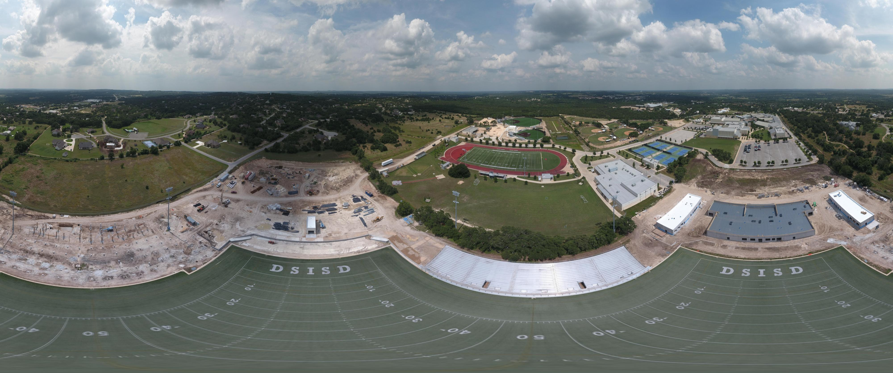

# OpenPano

## Introduction

OpenPano is an panorama stitching program written in C++ from scratch. It mainly follows the routine
described in the paper [Automatic Panoramic Image Stitching using Invariant Features](http://matthewalunbrown.com/papers/ijcv2007.pdf),
which is also the one used by [AutoStitch](http://matthewalunbrown.com/autostitch/autostitch.html).

[](https://travis-ci.org/ppwwyyxx/panorama)

### Compile Dependencies:

* gcc >= 4.7
* [Eigen](http://eigen.tuxfamily.org/index.php?title=Main_Page)
* [FLANN](http://www.cs.ubc.ca/research/flann/) (already included in the repository, slightly modified)
* [CImg](http://cimg.eu/) (optional. already included in the repository)
* libjpeg (optional. If you only need png, you can comment the jpeg macro in lib/imgio.cc)

Eigen, CImg and FLANN are header-only, to simplify the compilation on different platforms.
CImg and libjpeg are only used to read and write images, so you can easily get rid of them.

### Compile:
Linux / OSX (gcc or clang):
```
$ cd src; make
```
The default clang on OSX doesn't contain openmp support.
You may need a different clang or gcc. See #16.

Windows users can try cmake with the `CMakeLists.txt`.

### Options:

Three modes are available (set/unset the options in ``config.cfg``):
+ __cylinder__ mode. When the following conditions satisfied, this mode usually yields better results:
	+ Images are taken with almost-pure single-direction rotation. (as common panoramas)
	+ Images are given in the left-to-right order. (I might fix this in the future)
	+ Images are taken with the same camera, and a good ``FOCAL_LENGTH`` is set.

+ __camera estimation mode__. No translation is the only requirement on cameras.
  It can usually work well as long as you don't have too few images.
  But it's slower because it needs to perform pairwise matches.

+ __translation mode__. Simply stitch images together by affine transformation.
  It works when camera performs pure translation.  It also requires ordered input.

Some options you may care:
+ __FOCAL_LENGTH__: focal length of your camera in [35mm equivalent](https://en.wikipedia.org/wiki/35_mm_equivalent_focal_length). Only useful in cylinder mode.
+ __ORDERED_INPUT__: whether input images are ordered. has to be `1` in CYLINDER and TRANS mode.
+ __CROP__: whether to crop the final image to avoid irregular white border.

Other parameters are quality-related.
The default values are generally good for images with more than 0.7 megapixels.
If your images are too small and cannot produce satisfactory results,
it might be better to resize your images rather than tune the parameters.

### Run:

```
$ ./image-stitching <file1> <file2> ...
```

The output file is ``out.jpg``. You can play with the example data to start with.

Before dealing with very large images (4 megapixels or more), it's better to resize them. (I might add this feature in the future)

In cylinder/translation mode, the input file names need to have the correct order.

## Examples (All original data available for [__download__](https://github.com/ppwwyyxx/panorama/releases/tag/0.1)):

Zijing Apartment in Tsinghua University:


"Myselves":


<!--
   -Zijing Playground in Tsinghua University:
   -
	 -->

Carnegie Mellon University from 38 images



Newell-Simon Hall in CMU (this one is hard because objects are closer):


A full-view pano built from UAV images:


For more examples, see [results](results).

## Speed & Memory:
Tested on Intel Core i7-6700HQ, with `ESTIMATE_CAMERA` mode:

+ 11 ordered images of size 600x400: 3.2s.
+ 13 ordered images of size 1500x1112: 6s.
+ 38 unordered images of size 1300x867 (high vertical FOV): 51s.

Memory consumption is known to be huge with default libc allocator.
Simply use a modern allocator (e.g. tcmalloc, hoard) can help a lot.
Also, setting `LAZY_READ` to 1 can save memory at the cost of a minor slow down.

Peak memory in bytes (assume each input has the same w & h):

+ Without `LAZY_READ` option: finalw \* finalh \* 12 + #photos \* w \* h \* 12
+ With `LAZY_READ` option: finalw \* finalh \* 16 + #threads \* w \* h \* 12

## Algorithms
+ Features: [SIFT](http://en.wikipedia.org/wiki/Scale-invariant_feature_transform)
+ Transformation: use [RANSAC](http://en.wikipedia.org/wiki/RANSAC) to estimate a homography or affine transformation.
+ Optimization: focal estimation, [bundle adjustment](https://en.wikipedia.org/wiki/Bundle_adjustment), and some straightening tricks.

For details, see [my blog post](http://ppwwyyxx.com/2016/How-to-Write-a-Panorama-Stitcher/).

## Quality Guidelines

To get the best stitching quality:
+ While rotating the camera for different shots, try to keep the position of camera lens static.
+ Keep the exposure parameters unchanged.
+ Do not shoot on moving objects.
+ Objects far away will stitch better.
+ The algorithm doesn't work well with wide-angle cameras where images are distorted heavily. Camera
	parameters are needed to undistort the images.

## TODOs
+ run bundle adjustment on the sphere instead of the plane
+ use LAZY_READ & 1 byte image in multiband blender to reduce peak memory
+ faster gaussian blur kernel
+ port some hotspot (e.g. `dist.cc`) to neon
+ support EXIF metadata so the pano can be viewed on Facebook
